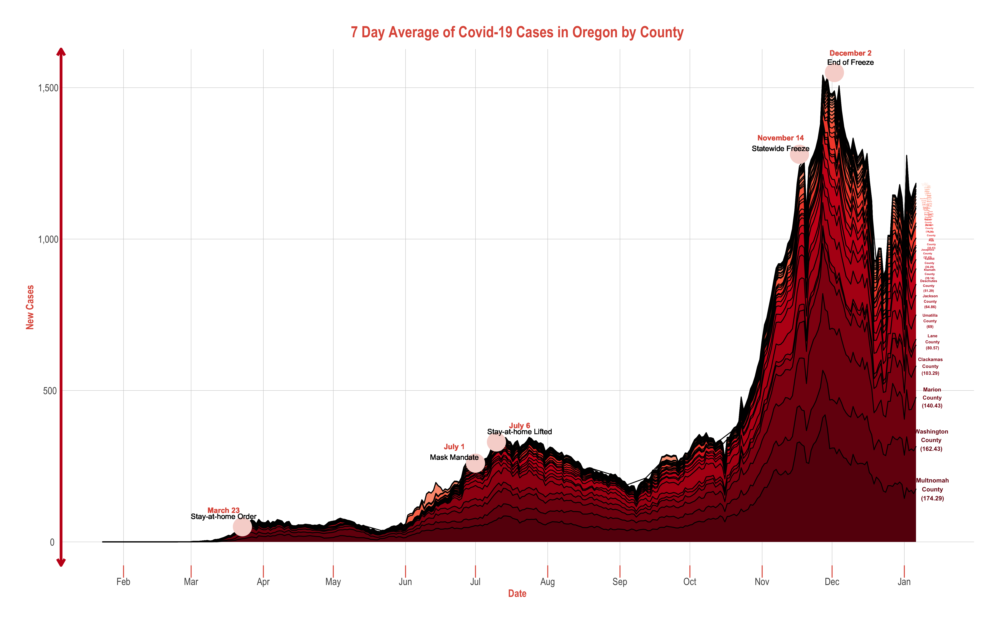

<!-- README.md is generated from README.Rmd. Please edit that file -->

```{r, include = FALSE}
knitr::opts_chunk$set(
  collapse = TRUE,
  comment = "#>",
  fig.path = "man/figures/README-",
  out.width = "100%"
)
```

# Visualisation of Coronavirus Case Statistics using R, Shiny and Plotly

Working on Oregon specific visualizations, as well as animations, interactive viz, and a Shiny app:




This repository contains the code of a simple R-Shiny web app which downloads and
visualizes the data of the Coronavirus (COVID-19). The **features** of the applications are: 

* Downloads daily case statistics of the Coronavirus by country.
* Let the user select country, region and metrics to be shown.
* Shows a nice time series plot of the daily and cumulated metrics.

